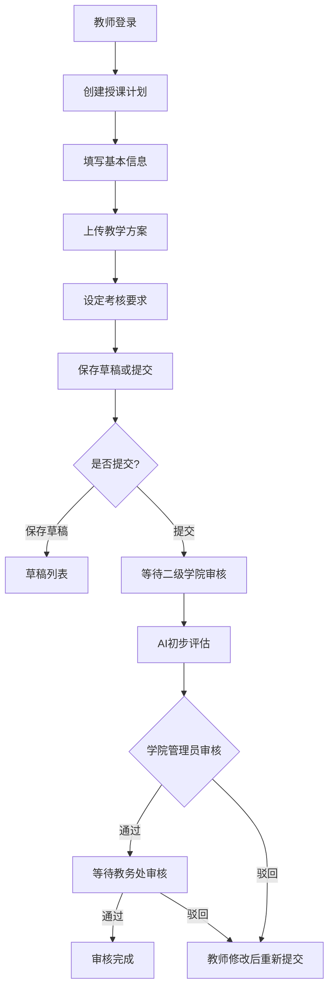
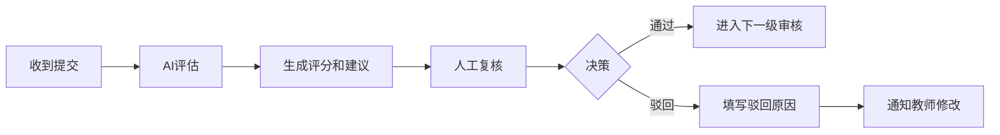

# 校级授课计划与复盘管理系统 - 产品需求文档

## 1. 产品概述

校级授课计划与复盘管理系统是一款面向高等院校的智能化教学管理平台，旨在实现授课计划的在线提交、二级学院审核、教务处审批的全流程数字化管理。系统内置专业培养方案目标、课程标准、产业需求分析等模块，并集成大语言模型进行阶段性材料智能评估与优化建议，为教学管理提供科学、高效的决策支持。

**目标用户：**
- 校内教师：提交授课计划、教学方案、考核要求
- 二级学院管理员：审核教师提交的材料
- 教务处管理员：最终审批材料
- 系统管理员：管理系统配置和用户权限

## 2. 核心功能

### 2.1 用户角色

| 角色 | 注册方式 | 核心权限 |
|------|----------|----------|
| 教师 | 系统分配账号 | 提交/编辑授课计划、查看审核状态、接收AI建议 |
| 学院管理员 | 系统分配账号 | 审核本学院材料、查看AI评估结果、选择通过或驳回 |
| 教务处管理员 | 系统分配账号 | 最终审批、查看全校统计、人工复核 |
| 系统管理员 | 系统分配账号 | 用户管理、角色配置、系统设置 |

### 2.2 功能模块

1. **授课计划管理**
   - 授课计划在线提交与编辑
   - 教学方案上传与管理
   - 考核要求设定
   - 材料状态追踪（草稿/已提交/审核中/已通过/已驳回）

2. **审核流程管理**
   - 二级学院初审
   - 教务处终审
   - 驳回修改与重新提交
   - 审核历史记录

3. **专业培养方案**
   - 培养目标管理
   - 课程标准维护
   - 产业需求分析
   -与人培方案对齐

4. **AI智能评估**
   - 阶段性材料自动分析
   - 评分与优化建议生成
   - 辅助人工审核决策
   - 评分结果记录

5. **数据看板**
   - 提交统计
   - 审核进度
   - AI评估概况

## 3. 核心流程

### 3.1 授课计划提交流程



### 3.2 审核决策流程



## 4. 用户界面设计

### 4.1 设计风格

- **整体风格**：专业、简洁、高效的教育管理风格
- **色彩方案**：
  - 主色：#2563EB（深蓝色，代表专业与信任）
  - 辅助色：#10B981（绿色，代表通过/成功）
  - 警示色：#EF4444（红色，代表驳回/警告）
  - 背景色：#F8FAFC（浅灰白）
  - 文字色：#1E293B（深灰）
- **字体**：思源黑体（Noto Sans SC）+ 思源宋体
- **布局**：左侧导航 + 右侧内容区，卡片式布局
- **图标**：Lucide Icons

### 4.2 页面设计

| 页面名称 | 模块名称 | UI元素 |
|----------|----------|--------|
| 登录页 | 登录表单 | 输入框、登录按钮、角色选择 |
| 仪表盘 | 统计卡片 | 数据卡片、图表、快捷入口 |
| 授课计划列表 | 列表/筛选 | 搜索框、状态标签、分页 |
| 授课计划详情 | 表单/预览 | 文件上传、文本编辑器、提交按钮 |
| 审核页面 | 审核面板 | AI评估结果、评分、通过/驳回按钮 |
| 培养方案管理 | 方案列表 | 树形结构、编辑表单 |
| AI评估面板 | 评估结果 | 评分展示、建议列表 |

### 4.3 响应式设计

- 桌面端优先设计
- 平板适配（1024px）
- 移动端适配（768px）

## 5. 数据模型

### 5.1 核心实体

- **用户（User）**：id, username, name, role, college, email
- **授课计划（TeachingPlan）**：id, title, teacher_id, content, status, created_at, updated_at
- **审核记录（ReviewRecord）**：id, plan_id, reviewer_id, status, comment, created_at
- **AI评估结果（AIEvaluation）**：id, plan_id, score, suggestions, evaluated_at
- **培养方案（TrainingProgram）**：id, name, objectives, courses, industry_requirements
- **课程标准（CourseStandard）**：id, program_id, course_name, standards

### 5.2 状态流转

```
草稿(DRAFT) -> 已提交(SUBMITTED) -> 审核中(REVIEWING) -> 学院通过(COLLEGE_APPROVED) -> 教务处通过(FINAL_APPROVED)
                                                                                -> 驳回(REJECTED)
```

## 6. 技术选型

- **前端框架**：React 18 + TypeScript
- **构建工具**：Vite
- **样式方案**：Tailwind CSS
- **状态管理**：Zustand
- **路由**：React Router DOM
- **图标**：Lucide React
- **Mock API**：json-server（模拟后端接口）
- **AI模拟**：本地模拟AI评估逻辑（实际项目中调用LLM API）
