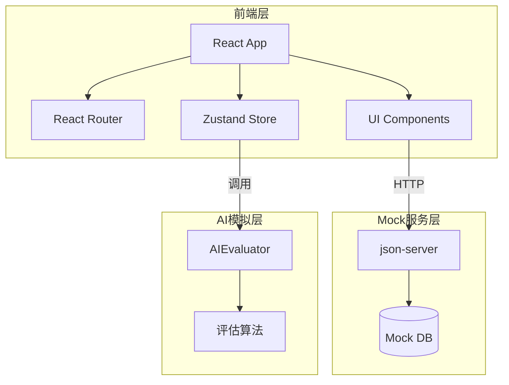

# 校级授课计划与复盘管理系统 - 技术架构文档

## 1. 架构设计



## 2. 技术栈

| 类别 | 技术 | 版本 |
|------|------|------|
| 前端框架 | React | 18.2.0 |
| 类型系统 | TypeScript | 5.3.3 |
| 构建工具 | Vite | 5.0.8 |
| 样式方案 | Tailwind CSS | 3.4.1 |
| 状态管理 | Zustand | latest |
| 路由 | React Router DOM | 6.x |
| 图标库 | Lucide React | 0.294.0 |
| Mock服务 | json-server | 0.17.4 |

## 3. 路由定义

| 路由 | 页面 | 权限 |
|------|------|------|
| /login | 登录页 | 公开 |
| /dashboard | 仪表盘 | 所有用户 |
| /plans | 授课计划列表 | 教师 |
| /plans/new | 创建授课计划 | 教师 |
| /plans/:id | 授课计划详情 | 教师/审核者 |
| /review | 审核列表 | 学院/教务管理员 |
| /review/:id | 审核详情 | 学院/教务管理员 |
| /training-programs | 培养方案管理 | 管理员 |
| /courses | 课程标准 | 管理员 |
| /users | 用户管理 | 管理员 |
| /settings | 系统设置 | 管理员 |

## 4. 数据模型

### 4.1 用户模型

```typescript
interface User {
  id: string;
  username: string;
  name: string;
  role: 'teacher' | 'college_admin' | 'academic_admin' | 'system_admin';
  college?: string;
  email: string;
  avatar?: string;
}
```

### 4.2 授课计划模型

```typescript
interface TeachingPlan {
  id: string;
  title: string;
  teacher_id: string;
  teacher_name: string;
  college: string;
  course_name: string;
  content: string;
  attachments: Attachment[];
  status: PlanStatus;
  ai_evaluation?: AIEvaluation;
  created_at: string;
  updated_at: string;
}

type PlanStatus = 'draft' | 'submitted' | 'college_reviewing' | 'college_approved' | 'academic_reviewing' | 'final_approved' | 'rejected';
```

### 4.3 AI评估模型

```typescript
interface AIEvaluation {
  id: string;
  plan_id: string;
  score: number; // 0-100
  dimension_scores: {
    completeness: number;
    clarity: number;
    alignment: number;
    practicality: number;
  };
  suggestions: string[];
  strengths: string[];
  evaluated_at: string;
}
```

### 4.4 审核记录模型

```typescript
interface ReviewRecord {
  id: string;
  plan_id: string;
  reviewer_id: string;
  reviewer_name: string;
  stage: 'college' | 'academic';
  status: 'approved' | 'rejected';
  comment: string;
  created_at: string;
}
```

## 5. API定义（Mock）

### 5.1 授课计划

| 方法 | 路径 | 描述 |
|------|------|------|
| GET | /plans | 获取授课计划列表 |
| GET | /plans/:id | 获取授课计划详情 |
| POST | /plans | 创建授课计划 |
| PUT | /plans/:id | 更新授课计划 |
| DELETE | /plans/:id | 删除授课计划 |
| POST | /plans/:id/submit | 提交授课计划 |

### 5.2 审核

| 方法 | 路径 | 描述 |
|------|------|------|
| GET | /reviews | 获取待审核列表 |
| POST | /reviews/:planId/approve | 审核通过 |
| POST | /reviews/:planId/reject | 审核驳回 |

### 5.3 AI评估

| 方法 | 路径 | 描述 |
|------|------|------|
| POST | /ai/evaluate | 发起AI评估 |
| GET | /ai/evaluation/:planId | 获取评估结果 |

## 6. 项目结构

```
/workspace
├── index.html
├── package.json
├── vite.config.ts
├── tailwind.config.js
├── tsconfig.json
├── src/
│   ├── main.tsx
│   ├── App.tsx
│   ├── index.css
│   ├── components/          # 公共组件
│   │   ├── Layout/
│   │   ├── Card/
│   │   ├── Button/
│   │   └── ...
│   ├── pages/               # 页面组件
│   │   ├── Login/
│   │   ├── Dashboard/
│   │   ├── Plans/
│   │   ├── Review/
│   │   └── ...
│   ├── stores/             # Zustand状态管理
│   │   ├── authStore.ts
│   │   ├── planStore.ts
│   │   └── ...
│   ├── hooks/              # 自定义Hooks
│   ├── utils/             # 工具函数
│   ├── types/             # TypeScript类型
│   └── data/
│       └── db.json        # Mock数据库
├── screenshots/           # 界面截图
└── README.md
```

## 7. 状态管理设计

### 7.1 Auth Store

```typescript
interface AuthStore {
  user: User | null;
  isAuthenticated: boolean;
  login: (username: string, password: string) => Promise<void>;
  logout: () => void;
}
```

### 7.2 Plan Store

```typescript
interface PlanStore {
  plans: TeachingPlan[];
  currentPlan: TeachingPlan | null;
  fetchPlans: () => Promise<void>;
  createPlan: (data: Partial<TeachingPlan>) => Promise<void>;
  updatePlan: (id: string, data: Partial<TeachingPlan>) => Promise<void>;
  submitPlan: (id: string) => Promise<void>;
}
```

## 8. AI评估模拟

由于实际项目中需要调用LLM API，本原型系统采用模拟方式实现AI评估功能：

- **评分算法**：基于规则的评价（完整性、清晰度、对齐度、实用性四个维度）
- **建议生成**：预定义的建议模板库，根据评估维度组合生成建议
- **扩展性**：预留AI接口，可在实际项目中替换为真实的LLM调用
